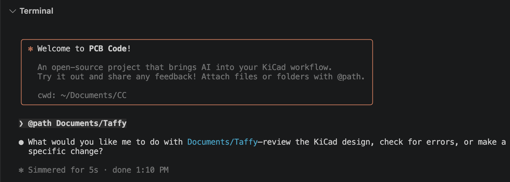
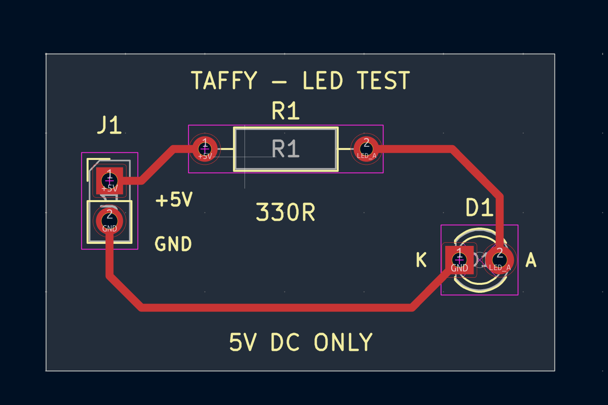

# PCB Code

Hey folks! This is Claude Code for PCB design.

PCB Code is an AI agent for KiCad that lives in your terminal. It reads, edits, and reloads your schematic and board files by talking to KiCad directly. Ask it to review a design, fix errors, add parts, route a board, or run DRC, and it does the work in your project folder.





## Installation

### 1. Install Node

PCB Code needs Node 22 or newer. Check what you have:

```
node --version
```

If that prints `v22` or higher, skip to step 2. Otherwise install Node from [nodejs.org](https://nodejs.org) (pick the LTS version), or with Homebrew on a Mac:

```
brew install node
```

### 2. Install PCB Code

```
npm install -g pcbcode
```

If you see an `EACCES` or "permission denied" error, npm is trying to write to a folder owned by root. Point it at your own folder and try again:

```
npm config set prefix ~/.local
npm install -g pcbcode
```

Then add this line to the end of `~/.zshrc` (or `~/.bashrc`) and open a new terminal:

```
export PATH="$HOME/.local/bin:$PATH"
```

### 3. Turn on the KiCad API

This lets PCB Code save and reload files inside KiCad so you never lose work.

1. Open KiCad.
2. Open Preferences (on a Mac: KiCad menu > Preferences, or press Cmd+comma).
3. Click **Plugins** in the left column.
4. Tick **Enable KiCad API** and click OK.

No restart needed.

### 4. Run it

Open a terminal in your KiCad project folder and start PCB Code:

```
cd ~/path/to/your/kicad/project
pcbcode
```

The first time it runs, it asks for your email and gives you a token. That is your account. You do not need an OpenAI key.

Keep the schematic or board editor open on the file you want PCB Code to work on, and start asking.

## Reloading

This section explains what happens when PCB Code edits a file that you also have open in KiCad, so you know what to expect.

**The problem.** KiCad keeps its own copy of your file in memory. If PCB Code changes the file on disk, KiCad does not notice. If you then save in KiCad, KiCad writes its old copy back over PCB Code's changes and the edit is lost.

**The fix.** Before and after every edit, PCB Code does three things:

1. **Save from KiCad.** It tells KiCad to save first, so the file on disk matches what you see on screen. If you had no unsaved changes this does nothing.
2. **Edit the file on disk.** It writes the change to a temporary file and then swaps it into place, so KiCad never sees a half-written file.
3. **Reload in KiCad.** It tells KiCad to reload the file from disk, which is the same as choosing File > Revert yourself. Your editor now shows the change.

**How it talks to KiCad.** For the board editor, PCB Code uses the KiCad API you turned on during installation. This is silent and needs no permissions.

For the schematic editor, KiCad 10 does not yet let the API save or reload. So on a Mac, PCB Code raises the schematic editor window, clicks File > Revert for you, and confirms the dialog. You will see the window come to the front for a moment. KiCad 11 will do this over the API too, and PCB Code already knows how.

**The one-time permission on a Mac.** Clicking menus in another app needs macOS Accessibility permission for the app you run PCB Code in (Terminal, iTerm, VS Code, Cursor, and so on). The first time PCB Code needs it, it opens System Settings > Privacy & Security > Accessibility for you and tells you which app to tick. Tick it, restart that app if it was already in the list, and try again. You only do this once.

**When nothing needs reloading.** If the editor for a file is not open, there is nothing to reload. PCB Code just edits the file and tells you it will load fresh when you open it.

**If the API is off.** PCB Code still works. It edits the file on disk and falls back to clicking File > Revert for both editors on a Mac, or asks you to reload on other systems. Turning the API on makes board reloads silent, so it is worth the one-time step above.

**What it installs.** The first time it needs to reach KiCad, PCB Code installs the KiCad Python client into its own private folder at `~/.pcbcode/venv`. It also keeps a small helper script in `~/.pcbcode`. Nothing touches your KiCad settings.

## License

MIT
